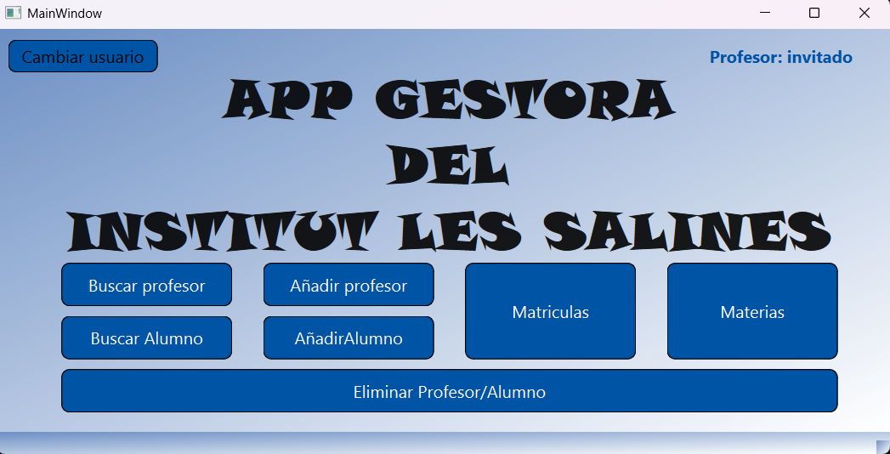

# proyecto-python-daw1
Aplicación de escritorio con interfaz gráfica que permite operaciones básicas de creación, lectura y eliminación (Create, Read, Delete), desarrollada en Python con PySide6 y SQLite. Proyecto realizado durante el primer curso del ciclo DAW.



## Contexto del Proyecto
Este proyecto fue desarrollado como parte del primer curso del ciclo DAW, con el objetivo principal de aplicar y consolidar conocimientos en el desarrollo de **interfaces gráficas de usuario (GUI)** con **PySide6** y la gestión de **bases de datos SQLite** para operaciones fundamentales de **CRUD (Create, Read, Delete)**. Lo se, faltó el update 😜

## Características

* **Creación de registros:** Permite añadir nuevas entradas a la base de datos.
* **Lectura y visualización:** Muestra todos los registros existentes en una tabla o lista.
* **Eliminación de registros:** Facilita la eliminación de entradas seleccionadas de la base de datos.

## Ejecución del proyecto

1.  **Instalar PySide6**
    Abre tu terminal y ejecuta el siguiente comando para instalar la librería necesaria:

    ```bash
    pip install PySide6
    ```

2.  **Lanzar archivo principal**
    Una vez instalado PySide6, navega hasta el directorio del proyecto en tu terminal y ejecuta el archivo principal:

    ```bash
    python main.py
    ```
